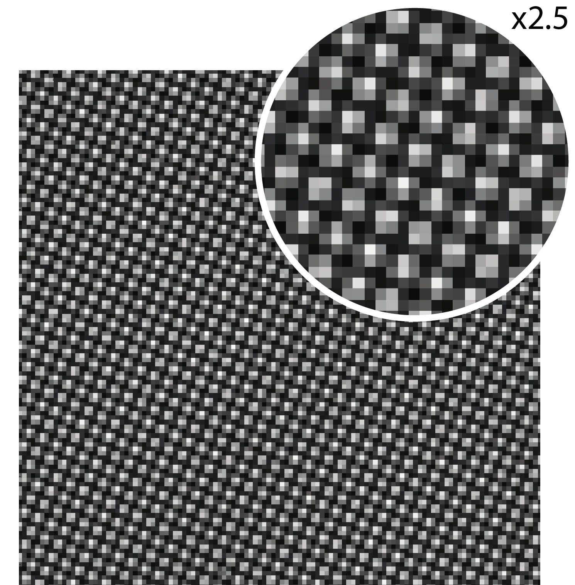
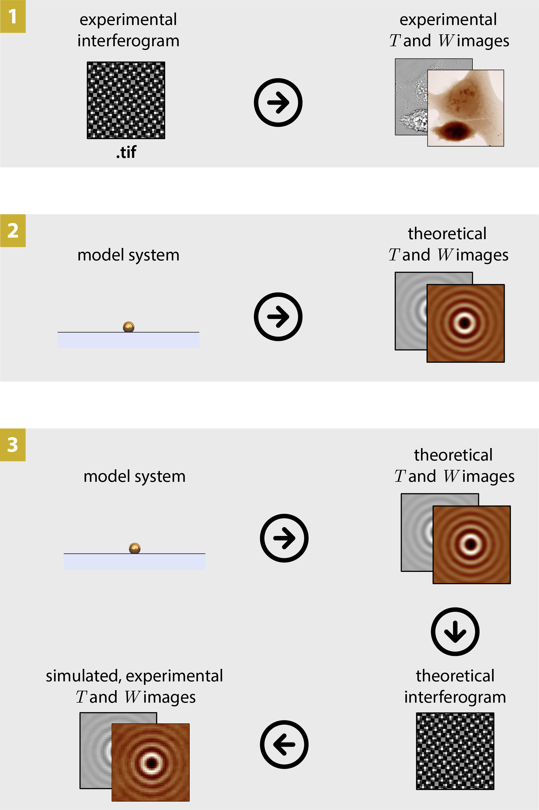

Introduction
============

What are QLSI and CGM?
----------------------

**QLSI (quadriwave lateral shearing interferometry)** is an optical imaging technique capable of mapping both the intensity and the wavefront profile of a light beam.\ [#ACSP10_322]_ Here are for instance intensity and wavefront images of a Bessel-like beam:

.. image:: images/QLSIimages.png
   :width: 400
   :align: center

|br|
This technique belongs to the quantitative phase imaging (QPI) family, the *wavefront* :math:`W` being simply related to the *phase* :math:`\phi` by the expression :math:`\phi=\frac{2\pi}{\lambda}W`.

:abbr:`QLSI (quadriwave lateral shearing interferometry)` is based on the the association of a regular camera with a special 2 dimensional diffraction grating, separated with each other by a millimeter distance.

.. image:: images/QLSIdevice.png
   :width: 400
   :align: center

Such an association gives rise to a modified image of the camera, called an interferogram, featuring an array of tiny bright spots. The intensity and wavefront images are processed from the interferogram image.

|br|

When a :abbr:`QLSI (quadriwave lateral shearing interferometry)` system is implemented in an optical microscope, the measured wavefront becomes the optical path difference (OPD) created by the micrometric object placed at the sample plane. This configuration is usually referred as **cross-grating wavefront microscopy (CGM)**.

The |PhaseLAB| **Matlab toolbox** is aimed to deal with :abbr:`QLSI (quadriwave lateral shearing interferometry)` images. It enables the processing of the interferogram into intensity and wavefront images, but also the simulations of interferograms, intensity, wavefront and :abbr:`OPD (optical path difference)` images from model objects, such as nanoparticles.

.. [#ACSP10_322] *Wavefront microscopy using quadriwave lateral shearing interferometry: from bioimaging to nanophotonics*, G. Baffou, **ACS Photonics** 10, 322-339 (2023)

The 3 main functionalities of |PhaseLAB|
----------------------------------------

|PhaseLAB| can be used for 3 main purposes:

1. **Convert** experimental :abbr:`QLSI (quadriwave lateral shearing interferometry)` interferogram images into images of interest, namely, wavefront, intensity, wavefront gradients, etc. **Process and do measurements** on these images using code lines, or using a :abbr:`GUI (graphical user interface)` interface (crop, plot crosscuts, filter, flatten, numerically refocus, measure dry masses, export, make movie, etc).
2. **In silico QLSI**, that is simulate :abbr:`QLSI (quadriwave lateral shearing interferometry)` intensity and wavefront/phase images of nanoparticles acquired with a specific microscope.
3. From the **In silico QLSI** simulation, compute the theoretical interferogram recorded by the camera in the presence of the :abbr:`QLSI (quadriwave lateral shearing interferometry)` grating, and process it as if it were an experimental interferogram.

The 3 functionalities are sketched below:

|br|   

This Matlab toolbox uses OOP
----------------------------

Instead of using functions with an arbitrary large number of input parameters, which can be quite cumbersome, the |PhaseLAB| Matlab toolbox leverages on the elegance of **object oriented programming (OOP)**. Basically, instead of using a function that needs all the parameters of the microscope (magnification, numerical aperture, wavelength, etc) ::

    output = fun(M, NA, lambda); 

one simply defines a variable (an object), ``MI``, that gathers all these properties. They can be accessed by writing ``MI.M``, ``MI.NA``, ``MI.lambda``. This way, the function only requires a single input parameter, favoring a good readibility of the code ::

    output = fun(MI); 

Basic examples of |PhaseLAB| codes
----------------------------------

Here are some simple code examples belonging to the three categories listed above. More examples can be found in the :ref:`Code_examples` section.

.. include:: /codeExamples/importExpImages.rst

.. include:: /codeExamples/automaticImportExpImages.rst

.. include:: /codeExamples/imageSimulation.rst

.. include:: /codeExamples/imagePostprocessing.rst

.. include:: /codeExamples/makeMovie.rst